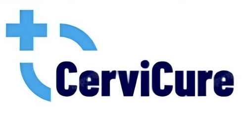
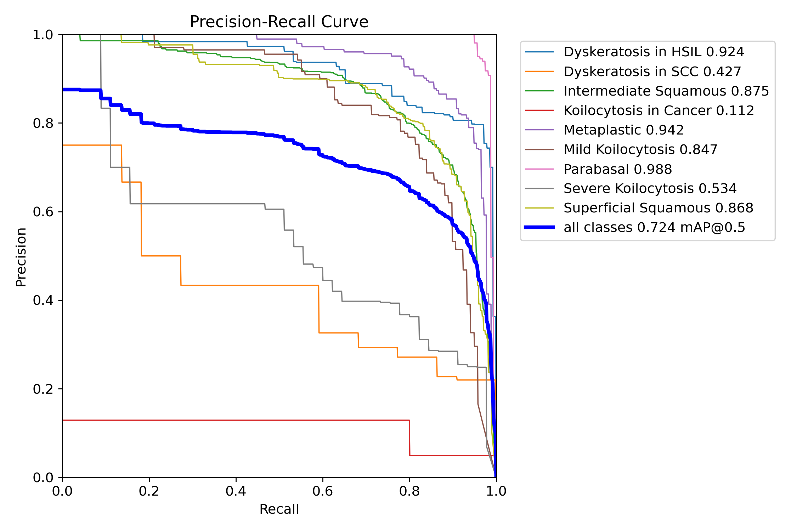
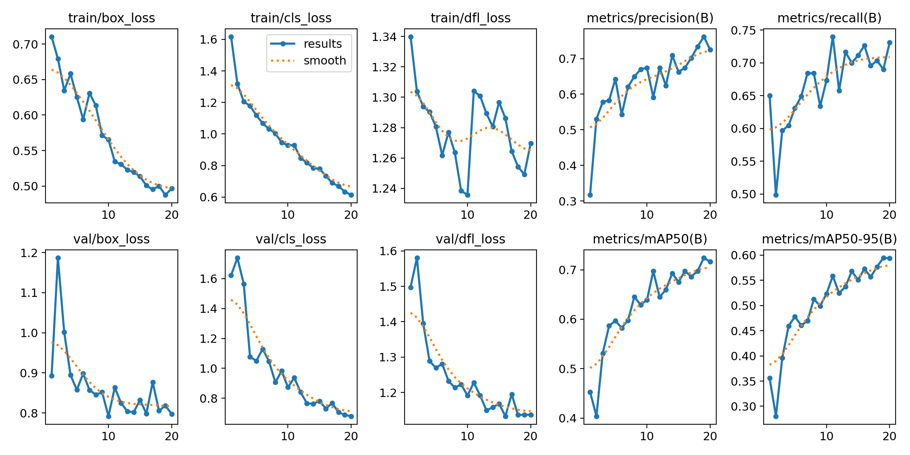

<h1 align = "center"> CERVICURE </h1> 

This repository contains the implementation of the YOLOv8 model for object detection as part of the CerviCure project. The model is trained to detect and classify objects in cervical cancer-related datasets. This README provides a step-by-step guide for setting up, training, and running the YOLOv8 model using Google Colab.

<h2>Table of Contents</h2>
<ul>
    <li><a href="#installation">Installation</a></li>
    <li><a href="#dataset-preparation">Dataset Preparation</a></li>
    <li><a href="#training-the-model">Training the Model</a></li>
    <li><a href="#validating-the-model">Validating the Model</a></li>
    <li><a href="#running-predictions">Running Predictions</a></li>
    <li><a href="#generating-classes-code">Generating Classes Code</a></li>
    <li><a href="#results-visualization">Results Visualization</a></li>
    <li><a href="#acknowledgements">Acknowledgements</a></li>
</ul>

<h2 id="installation">Installation</h2>
<ol>
    <li>Clone the repository:
        <pre><code>git clone https://github.com/ArnavGhosh999/CerviCure.git</code></pre>
    </li>
    <li>Install the required dependencies:
        <pre><code>pip install ultralytics</code></pre>
    </li>
    <li>Check the environment setup for YOLOv8:
        <pre><code>import ultralytics
ultralytics.checks()</code></pre>
    </li>
</ol>

<h2 id="dataset-preparation">Dataset Preparation</h2>
<ol>
    <li>Mount your Google Drive in Colab to access the dataset:
        <pre><code>from google.colab import drive
drive.mount('/content/drive')</code></pre>
    </li>
    <li>Navigate to the project directory:
        <pre><code>%cd /content/drive/MyDrive/CerviCure.v2i.yolov8</code></pre>
    </li>
    <li>Update the <code>data.yaml</code> file with the paths to your training and validation datasets.</li>
</ol>

<h2 id="training-the-model">Training the Model</h2>
<ol>
    <li>Load the YOLOv8 model:
        <pre><code>from ultralytics import YOLO
model = YOLO('yolov8m.pt')</code></pre>
    </li>
    <li>Fine-tune the model's training layers:
        <pre><code>layer_index = 0
for param in model.parameters():
    param.requires_grad = (layer_index == 1)
    layer_index += 1</code></pre>
    </li>
    <li>Train the model:
        <pre><code>model.train(
    data='data.yaml',
    epochs=20,
    batch=16,
    imgsz=640,
    optimizer='Adam',
    lr0=0.001,
    weight_decay=0.0005
)</code></pre>
    </li>
</ol>

<h2 id="validating-the-model">Validating the Model</h2>

Run model validation to assess performance:

<pre><code>results = model.val()
print(results)</code></pre>

<h2 id="running-predictions">Running Predictions</h2>
<ol>
    <li>Make predictions using a trained model:
        <pre><code>!yolo task=detect mode=predict model=/content/drive/MyDrive/CerviCure.v2i.yolov8/runs/detect/train8/weights/best.pt source=/content/drive/MyDrive/Cervix save=True</code></pre>
    </li>
    <li>Use the <code>predict_and_annotate</code> function to run predictions on new images and visualize the results:
        <pre><code>import cv2
import matplotlib.pyplot as plt
annotated_image = predict_and_annotate('path_to_image.jpg')
plt.imshow(cv2.cvtColor(annotated_image, cv2.COLOR_BGR2RGB))
plt.show()</code></pre>
    </li>
</ol>

<h2 id="generating-classes-code">Generating Classes Code</h2>
<ol>
    <li>Generate Python code for class definitions based on the <code>names</code> field in the <code>data.yaml</code> file:
        <pre><code>def generate_classes_code(data_yaml_path):
    # Function implementation</code></pre>
    </li>
    <li>Call the function to get class definitions:
        <pre><code>data_yaml_path = '/content/drive/MyDrive/CerviCure.v2i.yolov8/data.yaml'
classes_code = generate_classes_code(data_yaml_path)
print(classes_code)</code></pre>
    </li>
</ol>

<h2 id="results-visualization">Results Visualization</h2>
<ol>
    <li>Upload images and annotate them using the trained model:
        <pre><code>from google.colab import files
uploaded = files.upload()</code></pre>
    </li>
    <li>Display the annotated images:
        <pre><code>for filename in uploaded.keys():
    annotated_image = predict_and_annotate(filename)
    if annotated_image is not None:
        plt.figure(figsize=(12, 8))
        plt.imshow(cv2.cvtColor(annotated_image, cv2.COLOR_BGR2RGB))
        plt.axis('off')
        plt.show()
    else:
        print(f"Failed to process image: {filename})</code></pre>
    </li>
</ol>

<h2 id="acknowledgements">Acknowledgements</h2>
<ul>
    <li>The YOLOv8 model is provided by the <a href="https://ultralytics.com/">Ultralytics</a> team.</li>
    <li>The CerviCure project aims to assist in the detection and classification of cervical cancer-related abnormalities using deep learning techniques.</li>
</ul>

</body>
</html>

  

  

